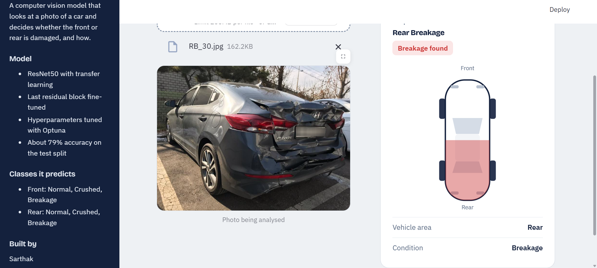
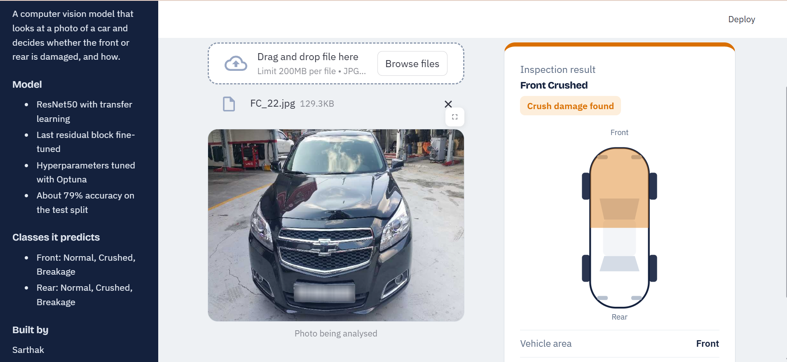
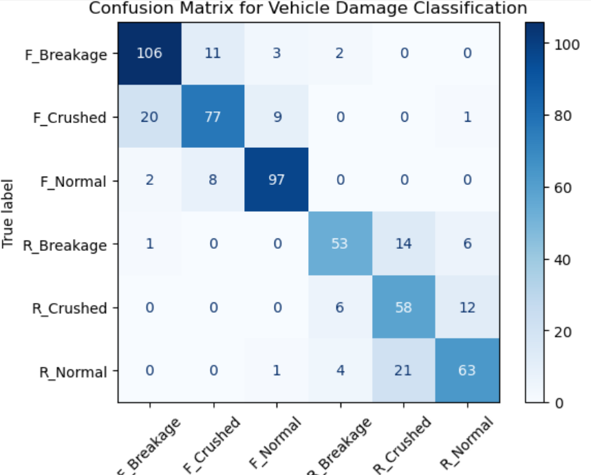

# 🚗 Vehicle Damage Detection

**A deep learning app that looks at a photo of a car and tells you whether the front or rear is damaged, and what kind of damage it is.**


Upload a JPG or PNG of a vehicle and the app returns one of six classes: **Front / Rear × Normal / Crushed / Breakage**. The result appears as a colour-coded inspection card with a top-down car diagram that highlights the affected half of the vehicle.

<p align="center">
  
</p>
<p align="center">
  
</p>

---

## Highlights

- **End-to-end project:** data loading and augmentation, transfer learning, hyperparameter tuning, evaluation, model export, and a deployed-style web UI.
- **Transfer learning with ResNet50:** an ImageNet-pretrained backbone with the last residual block (`layer4`) fine-tuned and a new classification head.
- **Automated tuning:** 20 Optuna trials with pruning to search learning rate and dropout.
- **Honest evaluation:** confusion matrix and per-class precision, recall and F1 on a held-out 575-image test split.
- **Polished UI:** custom-styled Streamlit app with a result card, car diagram and project sidebar, built to be easy to read at a glance.

---

## Results

Evaluated on **575 test images** (25% of 2,300).

| Metric | Value |
|---|---|
| Overall accuracy | **79%** |
| Macro F1 | 0.78 |
| Weighted F1 | 0.79 |
| Front vs rear identified correctly | **570 / 575 (99.1%)** |

### Per-class performance

| Class | Precision | Recall | F1 | Test images |
|---|---|---|---|---|
| Front Breakage | 0.82 | 0.87 | 0.84 | 122 |
| Front Crushed | 0.80 | 0.72 | 0.76 | 107 |
| Front Normal | 0.88 | 0.91 | 0.89 | 107 |
| Rear Breakage | 0.82 | 0.72 | 0.76 | 74 |
| Rear Crushed | 0.62 | 0.76 | 0.69 | 76 |
| Rear Normal | 0.77 | 0.71 | 0.74 | 89 |

### Confusion matrix

<p align="center">
  
</p>

### What the results show

- **The model almost never mixes up the front and the rear.** Only 5 of 575 images were assigned to the wrong end of the car. Nearly all errors are about the *type* of damage.
- **Front Normal is the easiest class** (F1 0.89), followed by Front Breakage.
- **The hardest cases are in the rear classes.** Rear Normal and Rear Breakage images are most often predicted as Rear Crushed (21 and 14 images), and Front Crushed is sometimes read as Front Breakage (20 images). Crushed and breakage damage can look very similar in a single photo.

---

## How it works


### Model

| Item | Detail |
|---|---|
| Backbone | ResNet50 pretrained on ImageNet |
| Fine-tuning | All layers frozen except `layer4` |
| Head | `Dropout(0.223)` then `Linear(2048, 6)` |
| Loss / optimiser | Cross-entropy / Adam |
| Training | 10 epochs |
| Augmentation | Random horizontal flip, rotation (10°), brightness and contrast jitter |
| Input | 224 × 224 RGB, ImageNet mean and std normalisation |

### Dataset

2,300 labelled car images in six class folders, split 75% / 25% into 1,725 training and 575 test images.

| Class folder | Meaning |
|---|---|
| `F_Breakage` | Front, broken parts |
| `F_Crushed` | Front, crush damage |
| `F_Normal` | Front, no damage |
| `R_Breakage` | Rear, broken parts |
| `R_Crushed` | Rear, crush damage |
| `R_Normal` | Rear, no damage |

### Hyperparameter tuning

Optuna ran 20 trials (maximising accuracy, with pruning of weak trials) over the learning rate and the dropout rate. The best trial reached **80.5%** accuracy, with dropout ≈ 0.22.

---

## The app

- Drag-and-drop upload for JPG, JPEG and PNG
- Colour-coded verdict: green for normal, orange for crushed, red for breakage
- Top-down car diagram that highlights the front or rear half
- Sidebar with model details and the list of classes
- Custom light theme, loading spinner and error handling if an image cannot be processed

---

## Run it locally

You need Python 3.12 or newer and [uv](https://docs.astral.sh/uv/).

```bash
# 1. Clone the repository
git clone <your-repo-url>
cd Vehicle_damage_prediction

# 2. Install dependencies (creates .venv automatically)
uv sync

# 3. Start the app from the app folder
cd streamlit-app
uv run streamlit run app.py
```

Then open the local URL that Streamlit prints (usually `http://localhost:8501`).

> Run the app from inside `streamlit-app/` so Streamlit picks up the theme in `.streamlit/config.toml`.

### Without uv

```bash
python -m venv .venv
.venv\Scripts\activate        # Windows
pip install streamlit torch torchvision pillow numpy
cd streamlit-app
streamlit run app.py
```

---

## Project structure

```
Vehicle_damage_prediction/
├── dataset/                   # training images, one folder per class
├── streamlit-app/
│   ├── .streamlit/
│   │   └── config.toml        # light theme
│   ├── assets/                # screenshots used in this README
│   ├── model/
│   │   └── saved_model.pth    # trained ResNet50 weights
│   ├── app.py                 # Streamlit interface
│   └── model_helper.py        # model definition and predict()
├── Damage_prediction.ipynb    # data prep, training, tuning, evaluation
├── pyproject.toml
├── requirements.txt
└── README.md
```

---

## Limitations and next steps

I'd rather be upfront about what this model can and can't do.

- **It is a single-photo classifier at about 79% accuracy.** Roughly 1 in 5 predictions will be wrong, mostly crushed versus breakage versus normal on the rear of the car. It is not a replacement for a professional inspection.
- **Small dataset.** 2,300 images across six classes is limited, and the rear classes are the weakest.
- **Evaluation can be tightened.** The train and test split is random without a fixed seed, and the test split was also used to compare tuning trials. A separate validation set and a seeded split would give a cleaner estimate.

Ideas for improving it:

- [ ] Collect more rear-damage images and rebalance the classes
- [ ] Use a seeded train / validation / test split with augmentation on training data only
- [ ] Show prediction confidence and the top-3 classes in the app
- [ ] Add Grad-CAM heatmaps to show which part of the photo drove the prediction
- [ ] Try stronger backbones (EfficientNet, ConvNeXt) and compare
- [ ] Deploy publicly on Streamlit Community Cloud

---

## Tech stack

Python · PyTorch · torchvision · ResNet50 · Optuna · scikit-learn · Streamlit · Pillow · NumPy · uv

---

## Author

Built by **Sarthak**.